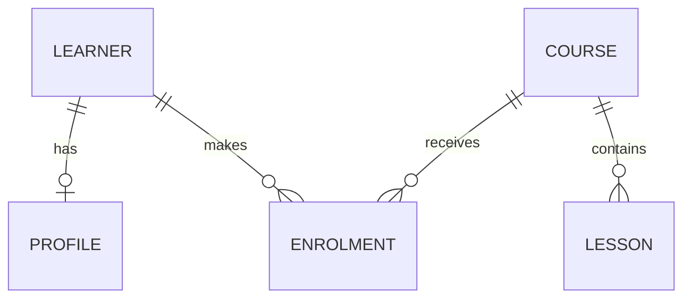

# QAI.02.01.06 — Relationships and cardinality

> QAI.02.01.05 keys and row identity → **QAI.02.01.06 relationships and cardinality** → QAI.02.01.07 data integrity and constraints

## 1. Destination: explain how many things can be linked

The course catalogue has learners, courses, course lessons, and optional learner profiles. A learner can join several courses; a course can contain several lessons; a learner may or may not have a profile. You will describe those rules in words, see them enforced where possible, and change a working in-memory database.

Use the [runnable project](QAI.02.01.06_Relationships_Lab.zip). **S90 target:** `C | L3 | H1–H3 | E2–E5 | A1–A4 | P0–P1`. Being able to draw the pattern and predict valid/invalid rows is part of implementing it.

## 2. Relationship type, instance, and cardinality

A **relationship** is an association between things represented by entities. A **relationship type** names the rule for a class of associations, such as “Learner enrols in Course.” A **relationship instance** is one actual association, such as “Anu (`learner_id = 1`) enrols in AI Foundations (`course_id = 101`).”

**Cardinality** answers how many instances on one side may relate to an instance on the other. Always name **both directions** and distinguish maximum from minimum:

| Question | Example answer |
|---|---|
| How many courses may one learner join? | Zero or more, in this lab's rules |
| How many learners may one course have? | Zero or more, in this schema; a business capacity is a separate rule |
| Must a lesson belong to a course? | Yes: one course for each stored lesson |
| Must every course already have a lesson? | No: the lab permits a course with none |

The words “one-to-many” alone do not tell you whether the *one* side is required for every many-side row, or whether a one-side row must have at least one child. Those are **minimum-participation** questions.

## 3. The four common shapes

### One-to-one relationship

A learner may have **zero or one** profile; each stored profile belongs to **exactly one** learner. The `profiles.learner_id` field is both that table's primary key and a reference to `learners.learner_id`. It cannot hold two profile rows for the same learner. Ravi has no profile, which is valid here.

“One-to-one” is a *maximum* of one in both directions. It does not mean every learner has a profile. The profile's link is mandatory; the learner's profile is optional.

### One-to-many relationship

One course may have **many** lessons. AI Foundations has two lesson rows. Each lesson refers to **exactly one** course in this schema, because its `course_id` is non-null and refers to a real course.

Viewed in reverse, several lessons each belong to one course: this is a **many-to-one relationship** from Lesson to Course. These are the same link read from opposite directions.

**Important:** `lessons.course_id NOT NULL` and a working foreign-key constraint require every stored lesson to have a real course; they do **not** force every course to have at least one lesson. A course with zero lessons is allowed by this schema.

### Many-to-many relationship

Anu joins AI Foundations and Git Basics; AI Foundations contains both Anu and Ravi. Thus Learner ↔ Course is **many-to-many**: both sides may associate with several instances of the other.

A **junction table**, also called an **associative table**, records each actual pair. Ours is `enrolments`:

| learner_id | course_id | Meaning |
|---:|---:|---|
| 1 | 101 | Anu → AI Foundations |
| 1 | 102 | Anu → Git Basics |
| 2 | 101 | Ravi → AI Foundations |

The **relationship key** here is the pair `(learner_id, course_id)`, which keeps an enrolment pair from being entered twice. A **foreign-key column** holds a value that points to another table: both `enrolments.learner_id` and `enrolments.course_id` have that role. Do not put a comma-separated list of learner IDs in the Course row to simulate a proper junction table.

## 4. Optional and mandatory are directional

An **optional relationship** has a minimum participation of zero on the side being discussed. A **mandatory relationship** has a minimum of one.

| Specific instance and direction | Lab rule | Why |
|---|---|---|
| Learner → Profile | Optional: 0 or 1 profile | Ravi can exist without a profile |
| Profile → Learner | Mandatory: exactly 1 learner | Profile's learner ID is non-null and must refer to a learner |
| Course → Lesson | Optional: 0 or many lessons | Course may be created before its lessons |
| Lesson → Course | Mandatory: exactly 1 course | Non-null `course_id` plus an enforced foreign key |
| Learner → Enrolment | Optional: 0 or many | Meera can exist before joining anything |
| Enrolment → Learner and Course | Mandatory: exactly 1 of each | The two non-null foreign keys refer to real rows |

**Common error:** “the relationship is mandatory” without saying *for which side*. For example, each lesson needs a course, yet a course need not contain any lessons. A rule like “every course must have at least one lesson” needs more than the child-side `NOT NULL`/foreign-key declarations shown here.

The sample also has capacity 2 for a course; the schema's many-to-many pattern does **not** automatically stop a third learner joining it. Capacity enforcement requires a separate controlled operation and concurrency policy later. Do not confuse *cardinality of a data model* with a course's enrolment limit.

## 5. Read an entity-relationship diagram

An **entity-relationship diagram**, or **ER diagram**, draws entity types and their links. The symbols here read from each named side: `||` means exactly one; `o|` means zero or one; `o{` means zero or many.



Read one line aloud: “One course may contain zero or many lessons; each lesson must be associated with exactly one course.” The two lines through ENROLMENT together implement the conceptual many-to-many relationship between learners and courses. The diagram shows this lab's rules, not every school's rules.

### Trace a possible new course

Can course `(103, 'Data Introduction', capacity=1)` be added with no lesson? **Yes.** The `COURSE ||--o{ LESSON` symbol allows zero lessons for a course; its required capacity must still be supplied. Can a new lesson name course `999` if that course does not exist? **No**, if foreign-key checking is on and the lesson's `course_id` is non-null. This distinction is the point of the diagram.

## 6. Run, alter, and debug the project

Unzip the project and run `python relationships.py`, then `python check_relationships.py`. Use `python3` if that is your Python command.

The initial output is:

```text
Foreign-key enforcement: on
Learners: 3
Profiles: 1
Courses: 2
Lessons: 3
Enrolments: 3
Course 101 lessons: 2
Course 101 learners: Anu, Ravi
Learners without profiles: Meera, Ravi
Learner without enrolments: Meera
```

The checker creates a **fresh database for each test** and confirms: a second profile for Anu fails; a profile for an unknown learner fails; a lesson pointing to an unknown course fails; a lesson without a course fails; a duplicate Anu–AI enrolment fails. It also checks that a new course **without** lessons succeeds. The tests do **not** prove a real application meets a capacity policy.

### H2 guided change

Run `python relationships.py --enrol-ravi-in-git`. This adds the valid pair `(Ravi, Git Basics)`. Expected: enrolments rise from 3 to 4; all other counts and course 101's learner names stay the same. Point to the new row and explain why it is neither a duplicate pair nor a missing reference.

### H3 independent change and worked solution

**Task:** permit a newly created course to exist without lessons or enrolments. Add it to `seed()` in a *copy* of the project:

```python
connection.execute(
    "INSERT INTO courses (course_id, title, capacity) VALUES (?, ?, ?)",
    (103, "Data Introduction", 1),
)
```

Place the course insertion after the existing course insert and before the other inserts. After **all** seed inserts, add this check at the end of `seed()` in the same copy:

```python
empty_course = connection.execute(
    "SELECT COUNT(*) FROM lessons WHERE course_id = ?",
    (103,),
).fetchone()[0]
assert empty_course == 0
```

Expected summary: courses = **3**; lessons = **3**; enrolments = **3**; C101 still has 2 lessons and Anu/Ravi; the added assertion passes. The new course needs a `capacity` because that column is non-null. The supplied checker uses course ID `103` for its own positive case; when testing your extended `seed()`, change **both** occurrences of `103` in `check_relationships.py` to `104`, or restore the original seed before running the original checker. Otherwise you correctly get a duplicate-course-ID error, which is unrelated to the optional relationship being tested.

**Debugging sequence:** if a supposed invalid link succeeds, inspect the exact table declaration, the referenced ID, `PRAGMA foreign_keys` on *that connection*, and whether the foreign-key column was nullable. If the wrong pair is rejected, inspect the two ordered components of the composite key; they have different meanings.

## 7. Solved checks and design decisions

| Question | Answer |
|---|---|
| Can Meera be a learner with no enrolment? | Yes. Learner → Enrolment is optional in this lab. |
| Can one course have two lessons? | Yes. Course → Lesson is one-to-many. |
| Does requiring every lesson to have a course guarantee every course has lessons? | No. It enforces the rule for **each lesson**, not for courses without lessons. |
| Is Anu's second course an invalid repeated learner ID? | No. It is a new enrolment pair, `(1,102)` instead of `(1,101)`. |
| Why is the pair a relationship key? | The two IDs together pick one enrolment instance; either ID by itself repeats legitimately. |
| Could a `profiles` row exist without a learner in the working demo? | No. It references a real learner and uses a non-null learner ID; the checker verifies rejection. |
| Can an ER diagram by itself enforce capacity or foreign keys? | No. It communicates intended structure; actual declarations and program logic determine enforcement. |

**Production thought:** document minimum and maximum participation separately, choose how deletes affect dependent rows, enable foreign keys for every SQLite connection, and review privacy before storing learner profiles. Concurrent enrolments and capacity control require later transaction and integrity work.

## Remember

- Relationship type is a general rule; relationship instance is one actual linked pair.
- Cardinality states how many; optional/mandatory state minimum participation **in a direction**.
- One-to-many and many-to-one are views of the same link from opposite ends.
- A junction/associative table stores instances of a many-to-many relationship.
- Its two foreign-key columns can form a relationship key; they still need valid referenced rows.
- An ER diagram communicates rules, but code and database constraints must enforce them.

## Primary references

- [Microsoft EF Core: one-to-many, optional and required sides](https://learn.microsoft.com/en-us/ef/core/modeling/relationships/one-to-many)
- [Microsoft EF Core: relationship terminology](https://learn.microsoft.com/en-us/ef/core/modeling/relationships/glossary)
- [SQLite: foreign-key constraints](https://sqlite.org/foreignkeys.html)
